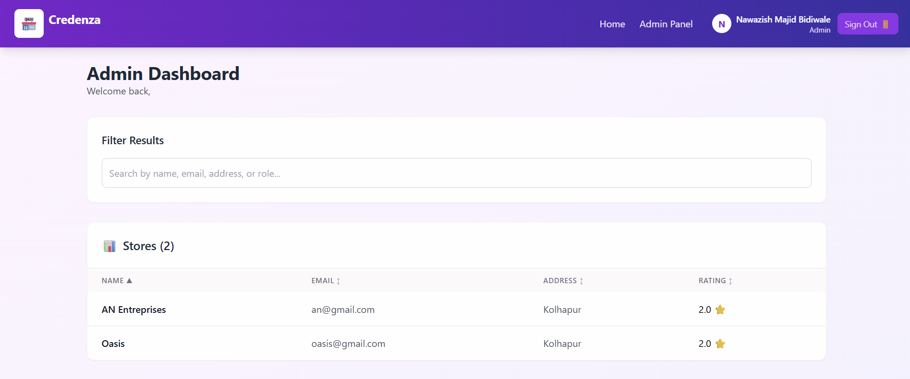
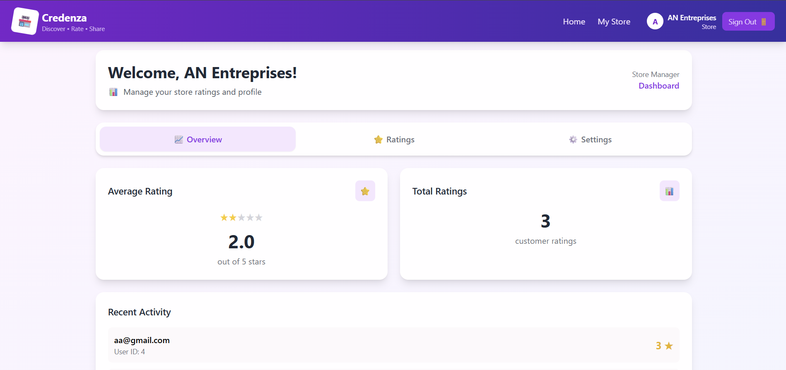
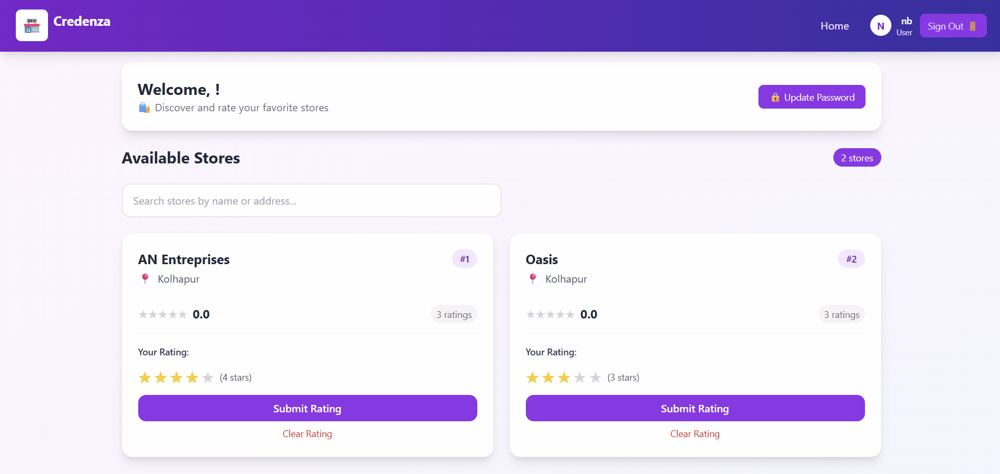

# 🗄️ Credenza

A full-stack web application for managing stores, users, and ratings. Supports **Admin** and **User** roles, with role-specific dashboards and functionalities.

---

## 🚀 Features by Role

### 🛡️ Admin
- Login as admin.
- View a dashboard with:
  - Total Users
  - Total Stores
  - Total Ratings
- Create:
  - New Users
  - New Admins
  - New Stores
- View list of all users and stores:
  - Users: Name, Email, Address, Role
  - Stores: Name, Email, Address, Average Rating
  - Columns are sortable: Click the arrow on any column to sort in ascending or descending order.
- Filter users/stores by name, email, address, or role.
- Logout securely.

 ## 🔑 Admin Access for Review

To test admin functionalities (creating users, stores, etc.), use the following credentials:

- **Email:** roxiler@gmail.com
- **Password:** Roxiler@123

> These credentials are only for testing purposes. You can log in as a normal user or admin to explore the application features.


🖼️ Screenshot:  
  
.png)  


---

### 🏪 Store Owner
- Login as store owner.
- View personal store performance including:
  - Average rating
  - Number of ratings
- Update store password.
- Logout securely.

🖼️ Screenshot:  

.png)
.png)

---

### 👤 User
- Register and login as a normal user.
- View all listed stores with:
  - Store Name, Email, Address, Ratings
- Rate any store (1–5 stars) and leave feedback.
- Update password.
- Logout securely.

🖼️ Screenshot:  
  


---

## ⚙️ Tech Stack

### 🔧 Backend:
- Node.js
- Express.js
- PostgreSQL (via Drizzle ORM)
- JWT Authentication
- Role-based Access Control

### 🎨 Frontend:
- React.js
- Vite + TailwindCSS
- React Router
- Context API for auth
- Axios for API calls

---

## 🛠️ Setup Instructions

**Clone this repository:**
```bash
git clone https://github.com/Nawaz-B-04/Credenza.git
cd Credenza
